<div align="center">

<picture>
  <source media="(prefers-color-scheme: dark)" srcset="assets/hero-dark.svg">
  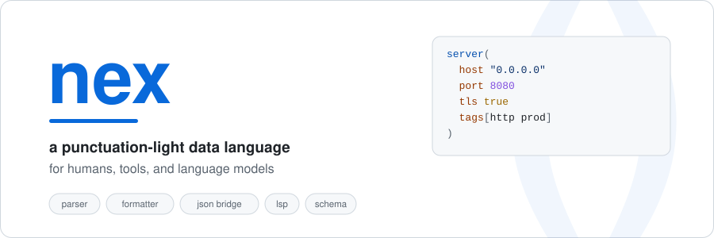
</picture>

<br>

[](https://github.com/k6w/nex-lang/actions/workflows/ci.yml)
[](https://www.rust-lang.org)
[](#license)
[](spec/nex-v1.md)

**[Quickstart](#quickstart)** · **[The language](#the-language-in-60-seconds)** · **[CLI](#cli-reference)** · **[Editors](#editor-support)** · **[Architecture](#architecture)** · **[Limitations](#known-limitations)**

</div>

---

nex is a data serialization language for configuration files and data exchange. It keeps
JSON's unambiguous structure but drops the punctuation you spend your day typing: no commas,
no colons, no braces. One canonical formatting means clean diffs and deterministic output —
which matters as much for a language model emitting config as it does for a human editing it.

```nex
server(
  host "0.0.0.0"
  port 8080
  tls  true
  tags[http prod]
)
```

nex is **not** a programming language. No expressions, no macros, no includes, no
indentation-significant semantics.

> Every screenshot below is generated from the real binary's output by
> [`tools/gen-assets.py`](tools/gen-assets.py). Nothing here is mocked.

---

## Quickstart

```bash
git clone https://github.com/k6w/nex-lang
cd nex-lang
cargo build --release
./target/release/nex check examples/config.nex
```

<picture>
  <source media="(prefers-color-scheme: dark)" srcset="assets/check-dark.svg">
  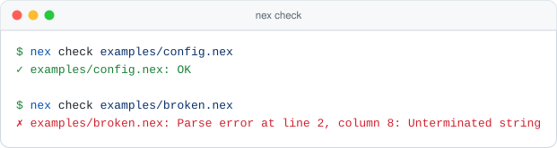
</picture>

`check` exits `0` when every file parses and `1` on the first failure, so it drops straight
into a pre-commit hook or CI step.

---

## The language in 60 seconds

<picture>
  <source media="(prefers-color-scheme: dark)" srcset="assets/source-dark.svg">
  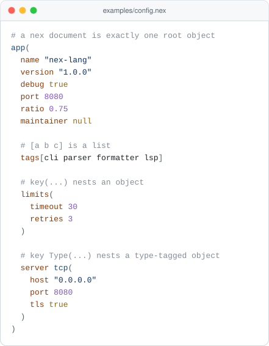
</picture>

### Values

| Type | Written as | Notes |
|---|---|---|
| null | `null` | |
| bool | `true` `false` | |
| int | `42` `-7` | 64-bit signed |
| float | `3.14` `-0.5` `6.02e23` | 64-bit IEEE |
| string | `"hello world"` | JSON escapes, including `\uXXXX` |
| symbol | `prod` `snake_case` | bare identifier; becomes a string in JSON |
| list | `[a b c]` | square brackets, always |
| object | `name(key value …)` | a type name followed by key/value pairs |
| object | `(key value …)` | anonymous — no type name |

Keys are bare symbols or quoted strings. Comments run to end of line with either `#` or `//`.
Whitespace and newlines are never significant — the formatter decides layout, you don't.

### The bracket rule

Brackets and parentheses are never interchangeable, so nothing about a value's shape depends
on how many items it happens to hold:

- `[` … `]` is **always a list**.
- `(` … `)` is **always an object**.
- A symbol immediately before `(` names the object's type.

<table>
<tr>
<td width="50%" valign="top">

<picture>
  <source media="(prefers-color-scheme: dark)" srcset="assets/nesting-dark.svg">
  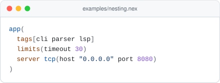
</picture>

</td>
<td width="50%" valign="top">

<picture>
  <source media="(prefers-color-scheme: dark)" srcset="assets/nesting-json-dark.svg">
  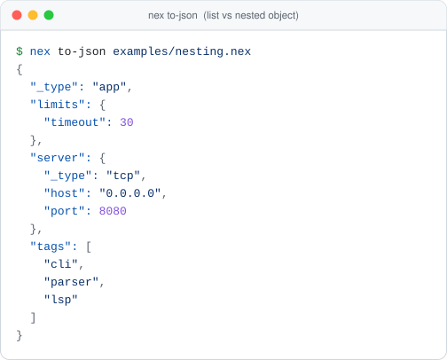
</picture>

</td>
</tr>
</table>

- `tags[cli parser lsp]` — a list of three symbols.
- `limits(timeout 30)` — an anonymous nested object.
- `server tcp(host … port …)` — a nested object tagged `tcp`. The tag survives the round trip
  to JSON as `_type`; anonymous objects carry no `_type`.

### Grammar

```ebnf
document := value                          (* exactly one *)
value    := "null" | "true" | "false"
          | int | float | string | symbol
          | [symbol] "(" (key value)* ")"  (* object, type name optional *)
          | "[" value* "]"                 (* list *)
key      := symbol | string
comment  := ("#" | "//") .* end-of-line
```

The full specification lives in [spec/nex-v1.md](spec/nex-v1.md).

---

## Canonical formatting

Any valid document formats into exactly one stable representation: two-space indent, one entry
per line, keys sorted alphabetically. Deterministic output means diffs show what actually
changed, and two tools that emit the same data emit the same bytes.

Formatting is lossless by construction, and the round trip is covered by tests: keys that
would not lex back as symbols are re-quoted, and floats keep a decimal point so `3.0` never
returns as the integer `3`.

<table>
<tr>
<td width="50%" valign="top">

<b>Before</b>

<picture>
  <source media="(prefers-color-scheme: dark)" srcset="assets/messy-dark.svg">
  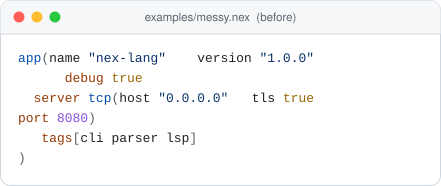
</picture>

</td>
<td width="50%" valign="top">

<b>After</b>

<picture>
  <source media="(prefers-color-scheme: dark)" srcset="assets/format-dark.svg">
  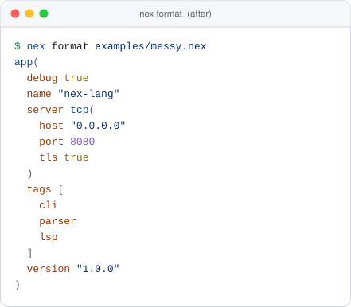
</picture>

</td>
</tr>
</table>

```bash
nex format config.nex           # print the canonical form
nex format --write config.nex   # rewrite in place
```

---

## JSON bridge

nex converts to and from JSON in both directions, so it drops into a pipeline that already
speaks JSON.

<table>
<tr>
<td width="50%" valign="top">

<b>nex → json</b>

<picture>
  <source media="(prefers-color-scheme: dark)" srcset="assets/to-json-dark.svg">
  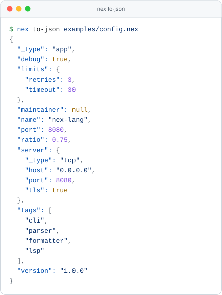
</picture>

</td>
<td width="50%" valign="top">

<b>json → nex</b>

<picture>
  <source media="(prefers-color-scheme: dark)" srcset="assets/from-json-dark.svg">
  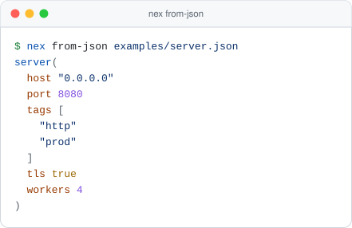
</picture>

</td>
</tr>
</table>

An object's type tag maps to the reserved `_type` key, so `server tcp(…)` round-trips through
JSON without losing its name. Symbols become JSON strings, and that direction is lossy — a
symbol and a quoted string both come back as strings.

---

## CLI reference

| Command | What it does |
|---|---|
| `nex check <files…>` | Parse each file. Exits `1` on the first error. |
| `nex format <files…>` | Print the canonical form to stdout. |
| `nex format --write <files…>` | Rewrite each file in place. |
| `nex to-json <file>` | Pretty-printed JSON on stdout. |
| `nex from-json <file>` | Canonical nex on stdout. |
| `nex lsp` | Run the language server over stdio. |

---

## Editor support

The [`vscode-extension/`](vscode-extension) directory contains a VS Code client backed by
`nex-lsp`. Today the server provides:

| Capability | Status |
|---|---|
| Diagnostics on open and on change | ✅ live parse errors |
| Document formatting | ✅ whole-document, via `nex-formatter` |
| Document symbols | ✅ objects and fields in the outline |
| Hover | ⚠️ advertised, returns nothing yet |

```bash
cd vscode-extension
npm install && npm run compile
```

Any LSP-capable editor can use the server directly by running `nex lsp` on stdio.

---

## Architecture

nex is a Rust workspace. The parser produces one `Value` tree that every other crate consumes.

<picture>
  <source media="(prefers-color-scheme: dark)" srcset="assets/architecture-dark.svg">
  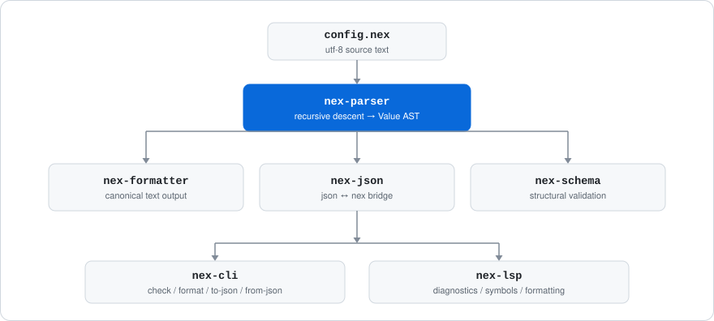
</picture>

| Crate | Responsibility |
|---|---|
| [`nex-parser`](crates/nex-parser) | Hand-written recursive-descent parser and the `Value` AST |
| [`nex-formatter`](crates/nex-formatter) | Canonical text output |
| [`nex-json`](crates/nex-json) | `Value` ↔ `serde_json::Value` |
| [`nex-schema`](crates/nex-schema) | Structural validation of a document against a schema document |
| [`nex-lsp`](crates/nex-lsp) | Language server built on `tower-lsp` |
| [`nex-cli`](tools/nex-cli) | The `nex` binary |

<picture>
  <source media="(prefers-color-scheme: dark)" srcset="assets/tests-dark.svg">
  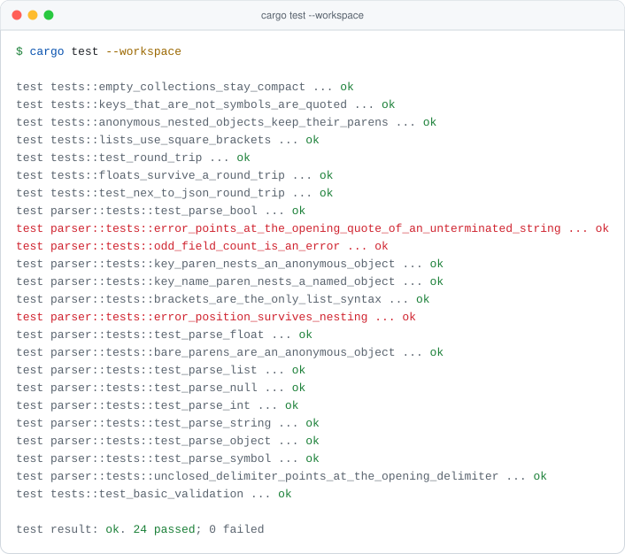
</picture>

---

## Known limitations

Honest list of where the implementation stands today. Contributions welcome on any of these.

1. **One root value per document.** `a(1)` followed by `b(2)` is a parse error.
2. **Field order is not preserved.** Fields live in a hash map, so `format` sorts keys
   alphabetically and a duplicate key silently keeps the last value.
3. **`nex-schema` has no CLI surface.** It is usable as a library; there is no `nex validate`.
4. **Hover is a stub.** The LSP advertises the capability and returns `None`.
5. **The VS Code extension resolves `bin/nex-lsp.exe`**, a Windows-only path.
6. **No block comments.** `#` and `//` run to end of line; `/* … */` is not recognised.

---

## Contributing

```bash
cargo build --release          # build the workspace
cargo test --workspace         # 24 tests, all green
cargo fmt --all                # CI auto-formats and pushes if you forget
python3 tools/gen-assets.py    # regenerate the README screenshots
```

`tools/gen-assets.py` shells out to `target/release/nex` and renders the real output, so the
images in this file cannot drift from the binary's behaviour without someone noticing. It also
mirrors every card into [`assets/png/`](assets/png) at 2x for slides, chat, and anywhere else
that will not render SVG (needs `rsvg-convert`; falls back to `qlmanage` on macOS).

Examples under [`examples/`](examples) double as the fixtures for those screenshots — every
one of them (except `broken.nex`, which is deliberately invalid) parses.

---

## License

MIT or Apache-2.0, at your option.
